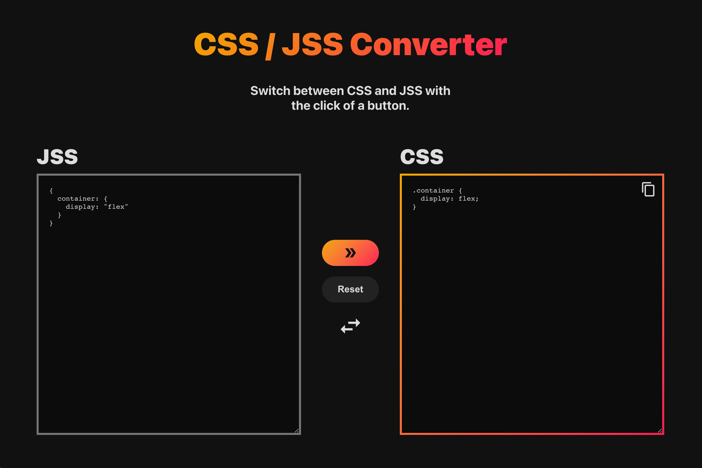

# Introduction

[Try it here](https://elina-codes.github.io/css-to-jss/)

Have you been tasked with refactoring your project's styling from JSS to CSS? Have you found a neat CSS snippet you want to integrate into your JSS-based project? Are you just plain in a hurry? Well have I got the tool for you!

Transform your CSS into JSS and your JSS into CSS with this one simple trick: this app.

Full disclosure, this was built in a day. Please don't hesitate to report bugs or send suggestions!

## How to Use

&nbsp;&nbsp;&nbsp;

1. Enter the value you want to convert into the left-hand textbox.
2. Click on the top button labeled "Convert" to start the conversion process.
3. View your results in the right-hand textbox. Click the "Copy" button located in the top right corner of the results textbox to copy its contents.
4. To clear both textboxes, click the "Reset" button.
5. To swap between the two formats, click on the bottom swap button.

## Tools

This app is built using React and TypeScript.
